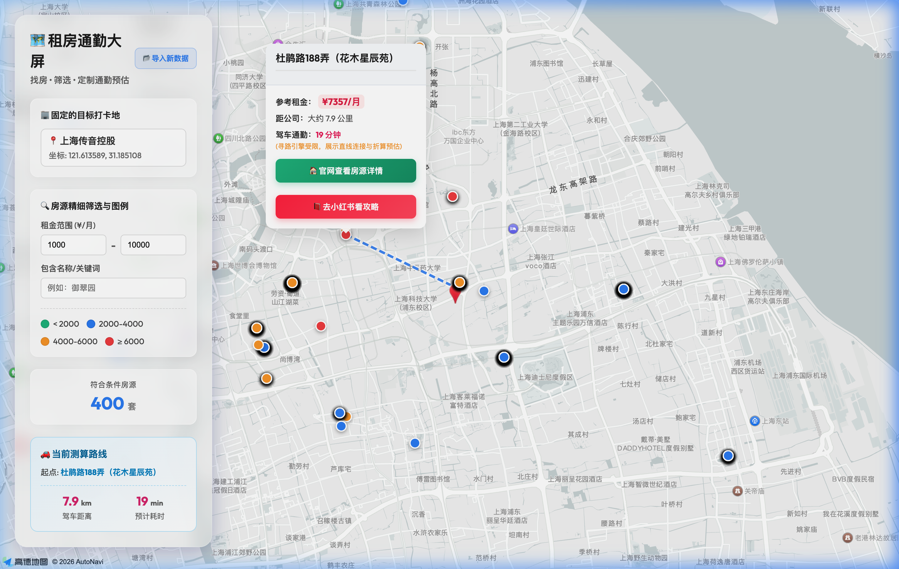

# 🗺️ 浦东公租房通勤辅助选房大屏 (PDGZF Commute Map)

> **专为高频打工人与租房客设计的可视化决策引擎：多维过滤 × 颜色热力 × 秒级测定精确通勤距！**

## ✨ 核心亮点

目前所有的官方查询通道通常提供枯燥的列表页展示，让人难以感知其究竟偏远几何。本开源大屏系统**基于高德地图引擎开发，不仅将长三角房源一次性投射入局，还直接与您的个人目标公司（默认上海传音控股等）自动测绘驾车距离与真实花费耗时！**

1. 🌈 **高维视角 价格热力显像**：
   摒弃了所有累赘的默认针尖与繁重图片。针对房租上下限做了**4阶直觉色彩分装**（绿、蓝、橙、红）。大范围内哪里的属于您的价格狩猎区间，只需看一眼地图上的彩虹分布即可了如指掌。

2. 🚀 **真·0成本 无后端 纯静态架构 (GitHub Pages 级部署标准)**：
   本前端纯静态运用了史诗级别的 “浏览器硬盘沙箱缓存机制 (LocalStorage)”！所有的数据流与筛选算法100%均由使用者本机CPU计算渲染，极速、安全。
   访客在界面上点击**【📂 导入新数据】**加载后，系统会自动吞下庞大的 5000+ 数学矩阵存入本地硬盘；不论后续多少次打开网页都会瞬发加载私人版地图！永不断连！

3. 🤖 **「书签黑客级无感爬虫」 兼容全域数据更新**：
   受够了手动开启 F12 剥离数据的烦恼？本系统还给高级用户配备了**全自动 Puppeteer RPA Node版爬虫**。如果觉得不够酷？还有免服务端验证、直破各种 CORS 同源限制的 **“一键公租房暗书签探针代码”**，登录公租房网站轻轻一点，庞大的房源库即跨空间传递进您的大屏。

4. 🚗 **驾车/网约车智能路书预警网**：
   一经定点，自动与云端驾车 API 对接画出弯曲行驶图；如果在网络极端/云端防刷封禁的情况下，系统内嵌的 **“兜底三维几何引擎”** 会以市区平均时速配合 1.3 倍的真实道路折损率，死死算出最靠谱的预估耗时，并将两点通过深蓝光子虚线显眼贯穿展示（如前图）。

5. 🔗 **红绿双擎全栈社交引流**：
   从查重房源、选定通勤范围、直接跳入官公租房网选屋，甚至通过大屏气泡卡片按钮 **一键直切“小红书（红）”** 查看前人的民间避雷评价帖，一气呵成！

## 📦 本地运行起步

请确保环境内安装有 `Node.js >= 18`。

\`\`\`bash
# 安装依赖
npm install

# 本地热起飞
npm run dev
\`\`\`

## 🛠️ 数据更新指南 (任选一款武功秘籍)

### 方案 A：开发者专属 (纯后端自动化)
我们开发了极其无脑的终端浏览器小精灵。一旦运行该命令，会在桌面现出一个 Chromium 视窗给您。您在此视窗内仅做扫码/注册登陆。
成功登录一刹那！浏览器背后的监听器就会狂吸全量地图信息覆盖本程序的 `src/output.json`，并自动退出进程。
\`\`\`bash
npm run fetch
\`\`\`

### 方案 B：普通散客专属 (本地手搓)
打开大屏网页界面右上角的【📂 导入新数据】，导入您本人提取保存的任何 `output.json`，纯前端自消化，1毫秒自动全盘渲染上墙！这是您若免费部署上线的王牌模式。

---

*Powered by React, Vite & 💙 for life convenience.*
